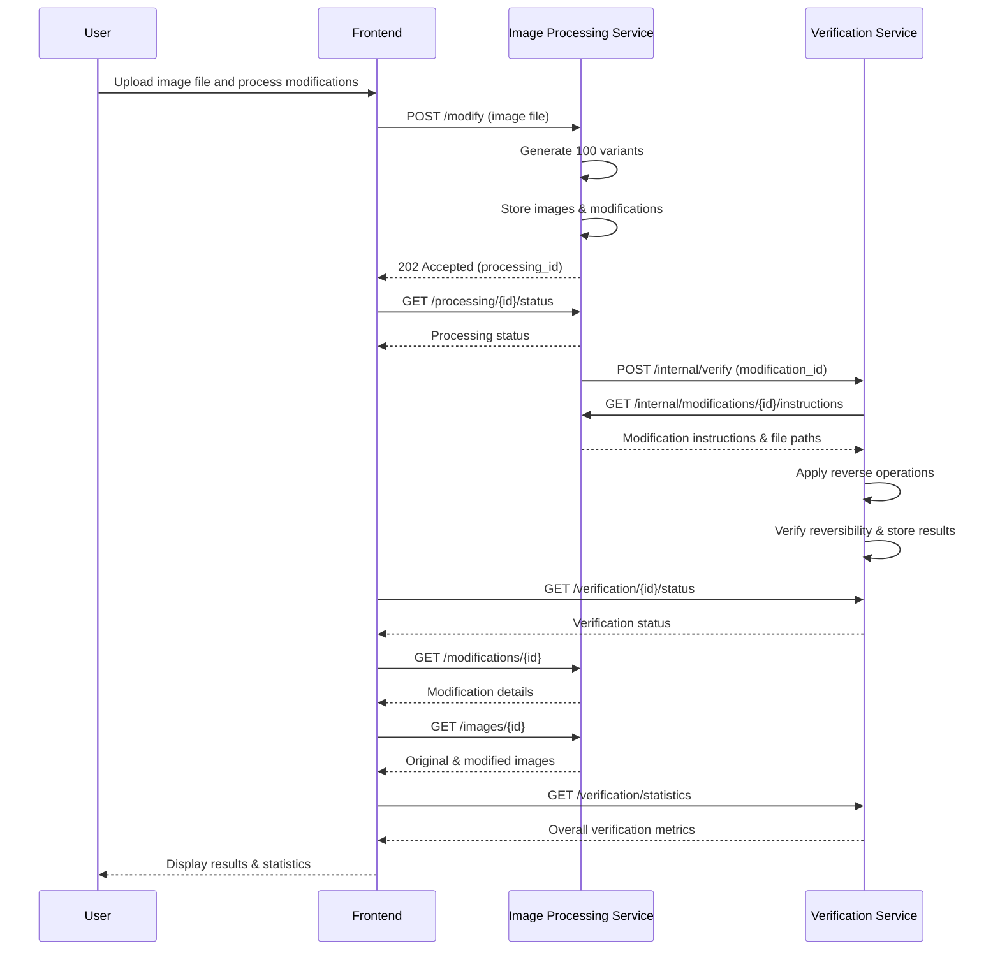

# Software Requirements Specification

## Reversible Image Modification System

### 1. Project Overview

The Reversible Image Alteration System is a distributed application that applies random pixel-level modifications to uploaded images, generates multiple variants, and verifies the reversibility of applied transformations. The system ensures data integrity through verification processes and maintains audit trails of all modifications.

### 2. Assumptions

- Images will be uploaded in standard formats (JPEG, PNG, BMP)
- System will handle images up to 100 Mb in size
- The system will run on a single server environment initially
- Network connectivity between services is reliable within the deployment environment
- Users have modern web browsers supporting React and ES6 modules
- Pixel modification algorithms maintain mathematical reversibility
- File system has sufficient storage capacity for original and modified images
- SQLite database is adequate for the expected concurrent load

### 3. Dependencies

- Python 3.12+ runtime environment
- SQLite database engine
- File system with read/write permissions
- Web server capable of serving static files and React build assets
- Modern web browser for frontend interface
- uv package manager for dependency resolution
- Docker & Docker Compose (optional, for containerized deployment)

### 4. Functional Requirements

#### 4.1 Image Processing Service

- Accept image file uploads via REST API endpoint
- Generate 100 variants of each uploaded image
    - Apply random number (100 to maximum pixel count) of pixel-level modifications (any reversible algorithm of choice) per variant
    - Implement reversible pixel modification algorithms (e.g. reordering, XOR value transformation)
- Store original and modified images in persistent file storage
- Record modification instructions and metadata needed to reverse the images in database
- Communicate processing status to other services via inter-service communication
- Provide REST API endpoints for frontend:
    - Image upload endpoint
    - Processing status queries
    - Modification history retrieval
    - Original image serving
    - Modified image variant serving
    - Image variant listing
- Provide REST API endpoints for inter-service communication:
    - Notification of completed modifications
    - Modification instruction sharing with Verification Service

#### 4.2 Verification Service

- Poll for unverified image modifications
- Retrieve modification instructions and file locations through API calls
- Apply reverse operations to modified images
- Compare reversed images with originals using hash or pixel-wise comparison
- Update verification status in database (pending/true/false)
- Log verification results and any discrepancies
- Provide REST API endpoints for frontend:
    - Verification status queries
    - Verification results and statistics
    - Verification history retrieval
- Provide REST API endpoints for inter-service communication:
    - Receiving verification requests
    - Reporting verification completion status

#### 4.3 Data Storage

- Image Processing Service maintains its own database for:
    - Upload tracking and processing status
    - Modification metadata including algorithm type and parameters
    - File paths for original and modified images
- Verification Service maintains its own database for:
    - Verification queue and task management
    - Verification results and status
    - Verification history and audit trail

#### 4.4 Web Interface

- React-based single-page application with component-based architecture
- Display processing progress and status updates by polling Image Processing Service
- Show verification results and modification statistics from Verification Service API
- Enable viewing of original and modified image variants served by Image Processing Service
- Present modification history and audit trail from both services

### 5. Non-Functional Requirements

#### 5.1 Performance

- Process image within 30 seconds for files up to 50MB
- Generate 100 variants within 5 minutes for standard resolution images
- Verification service should process modifications within 10 seconds each

#### 5.2 Reliability

- Graceful handling of service failures with retry mechanisms
- Data consistency across all services
- Complete reversibility verification for all modifications

#### 5.3 Scalability

- Support concurrent processing of multiple image uploads
- Handle image files up to 100MB in size
- Process up to 10 concurrent verification tasks

#### 5.4 Maintainability

- Modular codebase following FastAPI best practices with separate routers, dependencies, and schemas
- Comprehensive error logging throughout the application
- Automated testing coverage of core functionality

### 6. Technology Requirements

#### 6.1 Backend Technology Stack

- Python 3.12+ as primary development language
- FastAPI framework for REST API implementation
- SQLite database for data persistence
- uv for dependency management
- ruff for code linting and formatting

#### 6.2 Frontend Technology Stack

- React 18 for component-based user interface
- Vite for build tooling and development server
- Tailwind CSS for utility-first styling
- ES6 modules for modern JavaScript architecture

#### 6.3 Development Tools

- Git version control with accessible repository hosting
- Docker containers for easy deployment and reproduction
- Environment-based configuration management

### 7. System Architecture Requirements

#### 7.1 Service Communication

- Services must communicate via REST APIs rather than shared database access
- Each service provides two sets of REST API endpoints:
    - **Public APIs** for frontend integration
    - **Internal APIs** for inter-service communication
- Image Processing Service public API:
    - POST `/modify` for image uploads
    - GET `/processing/{id}/status` for processing status
    - GET `/modifications/{id}` for modification details
    - GET `/images/{id}/original` for serving original images
    - GET `/images/{id}/variants` for listing all image variants
    - GET `/images/{id}/variants/{variant_id}` for serving specific modified variants
- Image Processing Service internal API:
    - GET `/internal/modifications/{id}/instructions` to share modification data
- Verification Service public API:
    - GET `/verification/{id}/status` for verification status
    - GET `/verification/statistics` for overall verification metrics
    - GET `/verification/history` for verification audit trail
- Verification Service internal API:
    - POST `/internal/verify` to receive verification requests
- Use asynchronous communication patterns where appropriate
- Production grade service discovery and health checking is out of scope
- Decoupling services via middleware like message queues or event buses is out of scope

The following diagram illustrates the typical flow of API calls in the system:

#### 7.2 Data Management

- Each service maintains its own isolated database instance
- No direct database coupling between services
- Data consistency maintained through API contracts
- Implement proper database connection pooling within each service
- Ensure transactional integrity within individual service boundaries

### 8. Project Structure Requirements

#### 8.1 Directory Organization

- `/src` directory for all source code
- `/tests` directory for test suites
- `/config` directory for configuration files
- `/docs` directory for documentation

#### 8.2 Code Organization

- Follow FastAPI best practices with organized project structure:
    - `app/` main application directory
    - `app/api/` for API route definitions with separate router files
    - `app/core/` for configuration, security, and application lifecycle
    - `app/models/` for SQLAlchemy database models
    - `app/schemas/` for Pydantic request/response models
    - `app/services/` for business logic and external service integrations
    - `app/db/` for database configuration and session management
    - `app/utils/` for shared utility functions
- Service-specific directories within source structure
- Shared common utilities and dependencies

### 9. Data Requirements

#### 9.1 Image Storage

- Support common image formats (JPEG, PNG, BMP)
- Maintain original image quality and metadata
- Organize files in logical directory structure
- Implement file naming conventions for traceability

#### 9.2 Modification Metadata

- Store algorithm type and version information
- Record complete parameter sets for reproducibility
- Track timestamps for all operations
- Maintain referential integrity between images and modifications

### 10. Security Requirements

- Validate all uploaded file types and sizes
- Sanitize file names and paths
- Rate limiting on API endpoints is out of scope

### 11. Testing Requirements

- Unit tests for all service components
- Integration tests for inter-service communication
- End-to-end tests for complete workflow verification
- Performance tests for image processing operations
